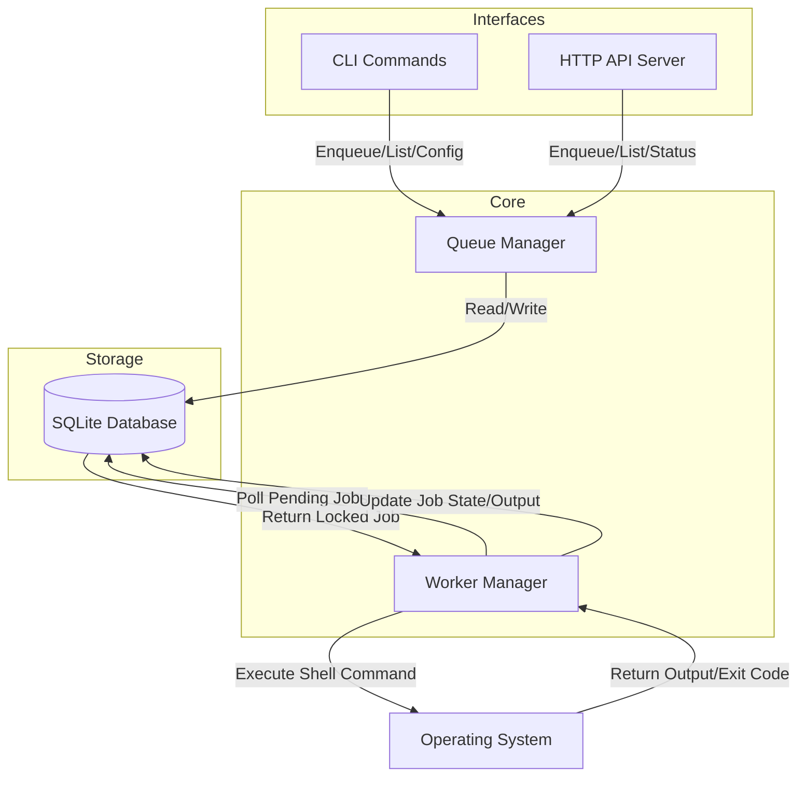

# QueueCTL Design & Architecture

QueueCTL is designed as a minimalist, single-binary job queue system that relies entirely on the Go Standard Library and a CGO-free embedded SQLite database. This architecture ensures absolute portability across operating systems while maintaining production-grade reliability.

## High-Level Architecture



## Core Components

1. **Storage Layer (`internal/storage/sqlite.go`)**
   - Uses `modernc.org/sqlite` to provide a CGO-free, embedded database.
   - Initialized with **WAL (Write-Ahead Logging)** and a `busy_timeout(5000)` to allow high-concurrency reads and writes without database locking errors.
   - Maintains the definitive state of all jobs, ensuring no data is lost if the application crashes or restarts.

2. **Queue Manager (`internal/queue/queue.go`)**
   - Provides a clean API for the CLI and HTTP server to enqueue new jobs and query job status.
   - Handles the initialization of job payloads (setting default `run_after`, `state`, and `created_at` timestamps).

3. **Worker Manager (`internal/worker/worker.go`)**
   - Responsible for spawning a configured number of concurrent goroutines.
   - Each worker runs an infinite loop, polling the database on an interval to claim jobs.
   - Leverages the OS shell (`cmd.exe` on Windows, `sh` on Unix) to execute the arbitrary payload commands.

## Concurrency & Locking

A common pitfall in queue design is race conditions—multiple workers attempting to process the same job. QueueCTL avoids this entirely by offloading the locking mechanism to the database engine.

Workers claim jobs using an atomic `UPDATE ... RETURNING` query:

```sql
UPDATE jobs 
SET state = 'processing', updated_at = CURRENT_TIMESTAMP 
WHERE id = (
    SELECT id FROM jobs 
    WHERE state = 'pending' AND run_after <= CURRENT_TIMESTAMP 
    ORDER BY created_at ASC 
    LIMIT 1
) 
RETURNING id, command, attempts, max_retries, output
```

Because SQLite guarantees atomic transactions, it is impossible for two workers to claim the same job, even when running at massive concurrency.

## Fault Tolerance & DLQ

- **Exponential Backoff**: When a job's command exits with a non-zero status code, the worker catches the error. Instead of dropping the job, it increments the `attempts` counter and schedules it in the future (`run_after = Now + backoff_base^attempts`).
- **Dead Letter Queue (DLQ)**: If a job exceeds its `max_retries` threshold, it is transitioned to a `dead` state. These jobs are quarantined indefinitely until an administrator inspects them and manually triggers a retry.
- **Output Logging**: The system captures both `stdout` and `stderr` directly from the OS execution buffer and persists it to the database for post-mortem debugging.
